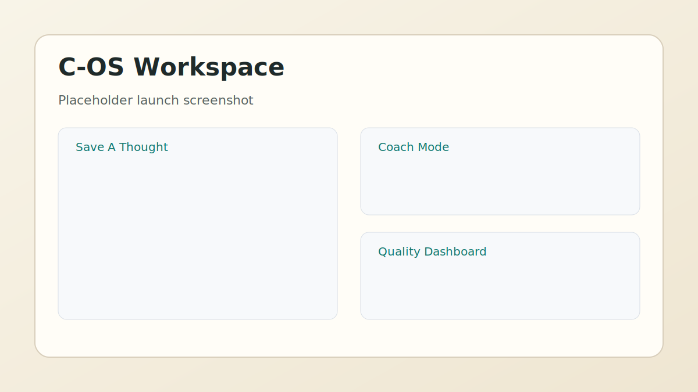
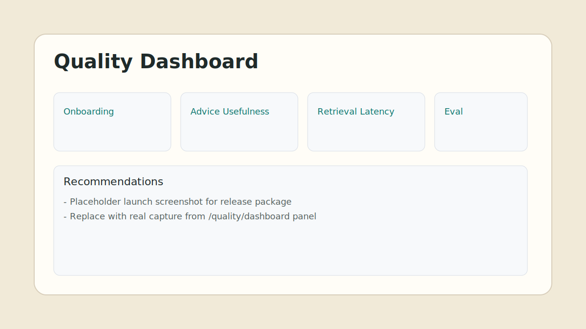

# COGNITIVE OS (C-OS) v0.1.0

C-OS is a persistent, evolving cognitive memory system for tracking how people think over time.

It models:
- ideas
- knowledge
- time
- contradictions
- evolution of thought

## Launch Highlights

- Temporal graph memory with contradiction-aware fact versioning.
- Hybrid retrieval (vector + graph + dynamic scoring).
- Non-technical UI with onboarding, coach mode, weekly summary, and quality dashboard.
- Built-in evaluation harness (`hybrid vs vector`) with `Hit@K`.
- Sprint 1-4 launch package ready for public release.

## Product Preview




## Quickstart

### Local

```bash
pip install -e ".[dev]"
uvicorn cos.app:app --reload
```

Open:
- UI: `http://127.0.0.1:8000/`
- API docs: `http://127.0.0.1:8000/docs`

### Docker

```bash
docker compose up --build
```

Open:
- UI: `http://127.0.0.1:8000/`
- Neo4j: `http://127.0.0.1:7474/`

Detailed setup: [QUICKSTART.md](docs/QUICKSTART.md)

One-command smoke test:

```powershell
powershell -ExecutionPolicy Bypass -File scripts/local_smoke_test.ps1
```

## Demo Package

- Demo guide: [DEMO.md](docs/DEMO.md)
- Video narration: [DEMO_VIDEO_SCRIPT.md](docs/DEMO_VIDEO_SCRIPT.md)
- Target output file: `docs/assets/demo-video.mp4`

## Sample Dataset

- Dataset: [sample_memory_notes.jsonl](datasets/sample_memory_notes.jsonl)
- Dataset docs: [datasets/README.md](datasets/README.md)
- Loader script:

```bash
python -m cos.experiments.load_sample_dataset
```

## Core UX Flow

1. Onboarding Progress
2. Save A Thought
3. Ask Memory
4. Coach Mode + feedback
5. Weekly Summary
6. Quality Dashboard + Evaluation Harness

## API Highlights

- `POST /ingest/text`
- `POST /query/retrieve`
- `POST /query/temporal`
- `POST /coach/advice`
- `POST /coach/checkin`
- `POST /coach/feedback`
- `POST /summary/weekly`
- `POST /evaluation/run`
- `GET /quality/dashboard`

## Evaluation

- Evaluation docs: [EVALUATION.md](docs/EVALUATION.md)
- Benchmark script:

```bash
python -m cos.experiments.benchmark_retrieval
```

## Release Notes

- [v0.1.0 release notes](docs/releases/v0.1.0.md)
- [CHANGELOG.md](CHANGELOG.md)

## Governance

- [LICENSE](LICENSE)
- [SECURITY.md](SECURITY.md)
- [CONTRIBUTING.md](CONTRIBUTING.md)
- [CODE_OF_CONDUCT.md](CODE_OF_CONDUCT.md)
