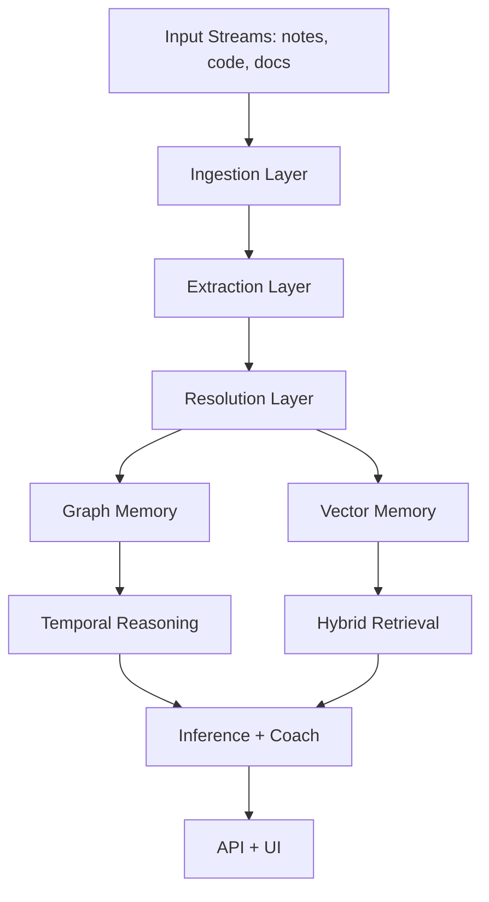

# Architecture

## Layer Responsibilities

- `ingestion`: normalization, chunking, source metadata.
- `extraction`: entities, relations, temporal signals.
- `resolution`: deduplication, contradiction handling, fact versioning.
- `graph`: structural memory with temporal validity.
- `vector`: semantic retrieval candidates.
- `temporal`: truth-at-time and trajectory analysis.
- `inference`: insights and actionable coaching outputs.
- `ui`: non-technical interface and API routes.

## Storage Strategy

- Graph backend: in-memory by default, Neo4j optional.
- Vector backend: in-memory by default, FAISS optional.
- Retrieval path: vector candidates -> graph expansion -> dynamic re-ranking.
